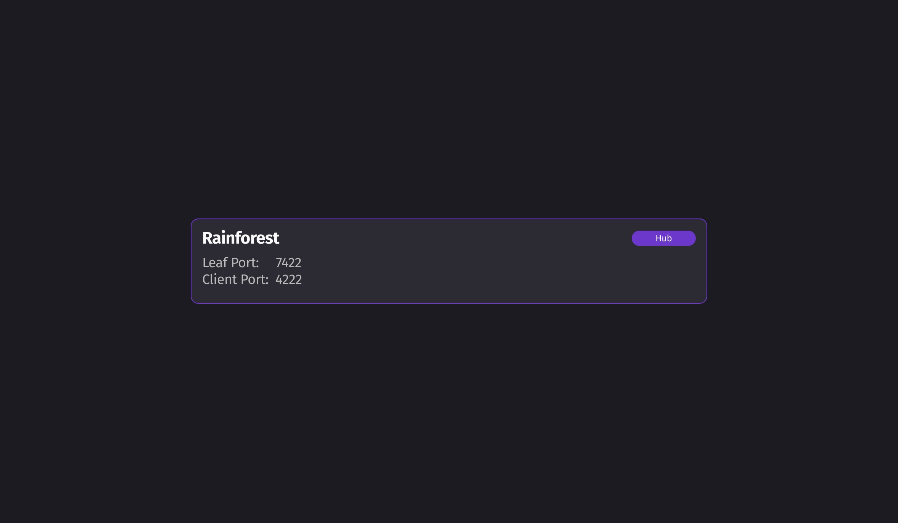
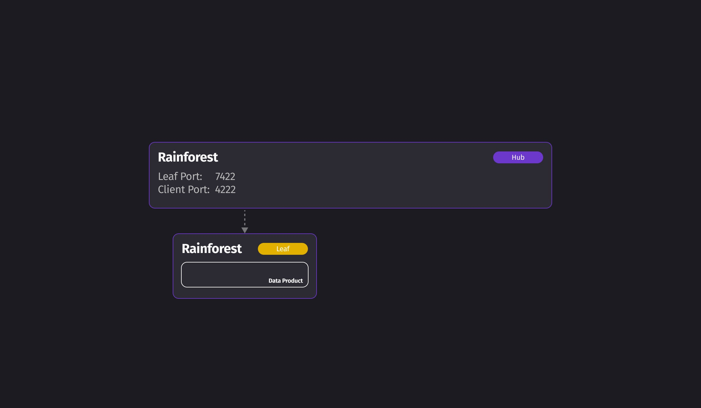
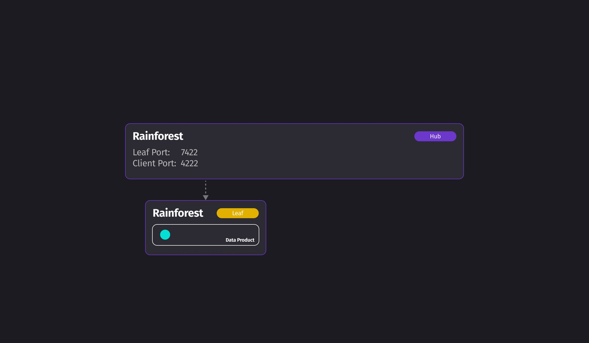
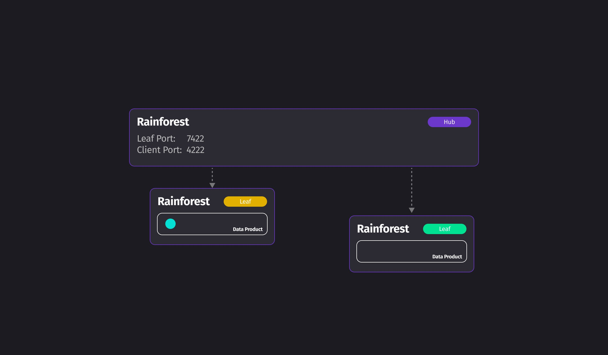
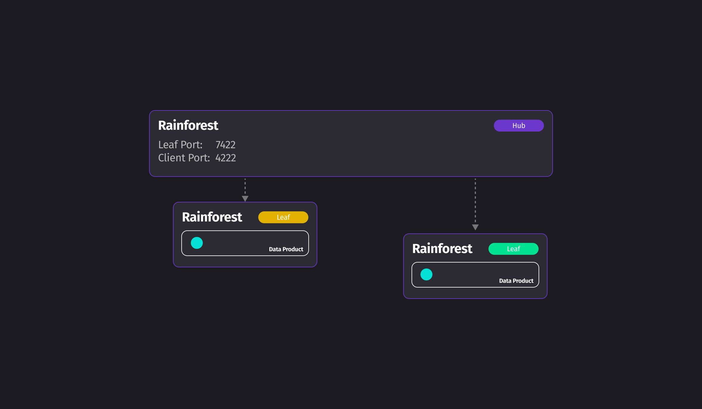

# Quickstart
這個 Quickstart 的目的是讓使用者可以快速了解、使用 rainforest 的核心功能。

## 啟動 Rainforest Hub
Rainforest 採取的架構是 Hub-Leaf (又稱作 Hub-Spoke) 的架構，在運行任何 Leaf 之前，建議先啟動 Rainforest Hub，以下指令可以啟動 Rainforest Hub。   
```
cd cmd/rainforest_hub
goreman start
```
現在系統的拓譜架構圖會像是下圖



以下是連線相關的 Port 資訊
* Client connections:   4222 
  * 主要負責處理 NATS Client 但由於是 Hub 所以這個 Port 使用者通常不會直接使用
* Leafnode connections: 7422 
  * 這個 Port 是用來處理 Leaf 連線的 Port，隸屬於這個 Hub 的 Leaf 都會經由這個 Port 溝通

## 啟動第一個 Rainforest Leaf 
以下的指令可以啟動 Rainforest Leaf，通常 Rainforest Leaf 就是組織中一個團隊發布和訂閱 Data Product 的實體。
``` bash
go run cmd/rainforest_leaf/rainforest_leaf.go \
--port=4111 \
--domain=tachun \
--hub-urls=localhost:7422 \
--kv-path=./data/badger/sts-0 \
--stream-path=./data/stream/sts-0 \
--sink-path=./data/sink/sts-0
```

以下為 flag 的說明
* --port:        這個 Leaf 的 NATS Client
* --domain:      這個 Leaf 的 Domain 名稱，通常可以用組織名稱當作命名標準  
* --hub-urls:    這個 Leaf 綁定的 Hub，一個 Leaf 可以綁定多個 Hub，雖然大多數的情況根本不用，因為 NATS Leaf Node 的設計本來就能夠容納數千個 Leaf Nodes
* --kv-path:     Key-Value Database 的存取路徑
* --stream-path: JetStream 存取的路徑

現在系統的拓譜架構圖會像是下圖


## 建立一個 State Data Product
接著我們建立一個 State Data Product，這個種類的 Data Product 專門用來處理狀態的儲存，我們可以直接透過 nats CLI 進行 API 呼叫。

``` bash
nats request '$RAINFOREST.API.DP.CREATE.*' --server=localhost:4111 \
'{
  "product": {
    "name": "OrdersState",
    "type": "DATA_PRODUCT_TYPE_STATE",
    "description": "This is a State Data Product"
  }
}'
```
可以藉由以下指令確認成功建立，其中 "STATE_" 前綴表示這是一個 State Data product。
``` bash
nats s ls --server=localhost:4111
╭─────────────────────────────────────────────────────────────────────────────────────────────────────────╮
│                                                 Streams                                                 │
├───────────────────┬──────────────────────────────┬─────────────────────┬──────────┬──────┬──────────────┤
│ Name              │ Description                  │ Created             │ Messages │ Size │ Last Message │
├───────────────────┼──────────────────────────────┼─────────────────────┼──────────┼──────┼──────────────┤
│ STATE_OrdersState │ This is a State Data Product │ 2023-08-25 06:01:13 │ 0        │ 0 B  │ never        │
╰───────────────────┴──────────────────────────────┴─────────────────────┴──────────┴──────┴──────────────╯
```
現在系統的拓譜架構圖會像是下圖


## 寫入 State 到 State Data Product
既然是 State Data Product，那我們不妨寫入一些 State 來做示範。

當我們在上個步驟建立 State Data Product 的時候，我們其實建立了一個 Stream，並且限制每一個 Subject 只能儲存 1 則訊息，我們可以直接當成 Table 來操作。

```
$RAINFOREST.DP.STATE.<data_product_name>.<primary_key> -> 這個 Subject 儲存的就是 State 序列化成 []byte 的格式(這裡方便說明，所以用簡單 string，實際場景是存取 JSON)
```

```
nats publish '$RAINFOREST.DP.STATE.OrdersState.0' value_0 --server=localhost:4111
nats publish '$RAINFOREST.DP.STATE.OrdersState.1' value_1 --server=localhost:4111
nats publish '$RAINFOREST.DP.STATE.OrdersState.2' value_2 --server=localhost:4111
nats publish '$RAINFOREST.DP.STATE.OrdersState.3' value_3 --server=localhost:4111
nats publish '$RAINFOREST.DP.STATE.OrdersState.4' value_4 --server=localhost:4111
nats publish '$RAINFOREST.DP.STATE.OrdersState.5' value_5 --server=localhost:4111
nats publish '$RAINFOREST.DP.STATE.OrdersState.6' value_6 --server=localhost:4111
nats publish '$RAINFOREST.DP.STATE.OrdersState.7' value_7 --server=localhost:4111
nats publish '$RAINFOREST.DP.STATE.OrdersState.8' value_8 --server=localhost:4111
```

``` bash
nats s ls --server=localhost:4111
╭──────────────────────────────────────────────────────────────────────────────────────────────────────────╮
│                                                 Streams                                                  │
├───────────────────┬──────────────────────────────┬─────────────────────┬──────────┬───────┬──────────────┤
│ Name              │ Description                  │ Created             │ Messages │ Size  │ Last Message │
├───────────────────┼──────────────────────────────┼─────────────────────┼──────────┼───────┼──────────────┤
│ STATE_OrdersState │ This is a State Data Product │ 2023-08-25 06:01:13 │ 9        │ 639 B │ 26.92s       │
╰───────────────────┴──────────────────────────────┴─────────────────────┴──────────┴───────┴──────────────╯
```
## 我們嘗試從 State Data product 讀取看看 State
```
nats subscribe '$RAINFOREST.DP.STATE.OrdersState.3' --last --server=localhost:4111

[#1] Received JetStream message: stream: STATE_OrdersState seq 4 / subject: $RAINFOREST.DP.STATE.OrdersState.3 / time: 2023-08-25T06:03:38Z
value_3
```

## 我還設計了一個 OLTP 可以直接變成 Sorted Map，嘗試看看 Range Query 吧! (可以直接開發成 Prod-Level RESTful API)
``` bash
nats request '$RAINFOREST.API.KV.*' \
'{
  "scan": {
    "limit": 10,
    "reverse": false,
    "start_key": "OrdersState/3",
    "end_key": "OrdersState/"
  }
}
' --server=localhost:4111 | jq
```
## 建立一個 Event Data Product
當然啦，rainforest 除了可以處理 State，Event 當然也可以處理 (畢竟 Gravity 就是建立在 Event 之上的嘛~)

我們建立一個 Event Data Product

``` bash
nats request '$RAINFOREST.API.DP.CREATE.*' --server=localhost:4111 \
'{
  "product": {
    "name": "ConversationEvent",
    "type": "DATA_PRODUCT_TYPE_EVENT",
    "description": "This is a Event Data Product"
  }
}'
```

可以藉由以下指令確認成功建立，其中 "EVENT_" 前綴表示這是一個 Event Data product。
``` bash
nats s ls --server=localhost:4111

╭────────────────────────────────────────────────────────────────────────────────────────────────────────────────╮
│                                                    Streams                                                     │
├─────────────────────────┬──────────────────────────────┬─────────────────────┬──────────┬───────┬──────────────┤
│ Name                    │ Description                  │ Created             │ Messages │ Size  │ Last Message │
├─────────────────────────┼──────────────────────────────┼─────────────────────┼──────────┼───────┼──────────────┤
│ EVENT_ConversationEvent │ This is a Event Data Product │ 2023-08-25 06:06:58 │ 0        │ 0 B   │ never        │
│ STATE_OrdersState       │ This is a State Data Product │ 2023-08-25 06:01:13 │ 9        │ 639 B │ 3m46s        │
╰─────────────────────────┴──────────────────────────────┴─────────────────────┴──────────┴───────┴──────────────╯
```
## 寫入 Event 到 Event Data Product
``` bash
nats publish '$RAINFOREST.DP.EVENT.ConversationEvent.1' \
'{
  "from": "Tachun",
  "to": "Fred",
  "payload": "Hi Fred how are you today",
  "timestamp": "2023-08-25T08:00:00Z"
}' --server=localhost:4111

nats publish '$RAINFOREST.DP.EVENT.ConversationEvent.2' \
'{
  "from": "Fred",
  "to": "Tachun",
  "payload": "Hello Tachun Im good thanks And you",
  "timestamp": "2023-08-25T08:01:00Z"
}' --server=localhost:4111

nats publish '$RAINFOREST.DP.EVENT.ConversationEvent.3' \
'{
  "from": "Tachun",
  "to": "Fred",
  "payload": "Im doing well thanks for asking",
  "timestamp": "2023-08-25T08:02:00Z"
}' --server=localhost:4111

nats publish '$RAINFOREST.DP.EVENT.ConversationEvent.4' \
'{
  "from": "Fred",
  "to": "Tachun",
  "payload": "Great to hear Do you have plans for the weekend",
  "timestamp": "2023-08-25T08:03:00Z"
}' --server=localhost:4111

nats publish '$RAINFOREST.DP.EVENT.ConversationEvent.5' \
'{
  "from": "Tachun",
  "to": "Fred",
  "payload": "Yes Ill be visiting some friends How about you",
  "timestamp": "2023-08-25T08:04:00Z"
}' --server=localhost:4111

nats publish '$RAINFOREST.DP.EVENT.ConversationEvent.6' \
'{
  "from": "Fred",
  "to": "Tachun",
  "payload": "I might go hiking if the weather is good",
  "timestamp": "2023-08-25T08:05:00Z"
}' --server=localhost:4111

nats publish '$RAINFOREST.DP.EVENT.ConversationEvent.7' \
'{
  "from": "Tachun",
  "to": "Fred",
  "payload": "That sounds lovely Have a great time",
  "timestamp": "2023-08-25T08:06:00Z"
}' --server=localhost:4111

nats publish '$RAINFOREST.DP.EVENT.ConversationEvent.8' \
'{
  "from": "Fred",
  "to": "Tachun",
  "payload": "Thanks You too Talk later",
  "timestamp": "2023-08-25T08:07:00Z"
}' --server=localhost:4111

nats publish '$RAINFOREST.DP.EVENT.ConversationEvent.9' \
'{
  "from": "Tachun",
  "to": "Fred",
  "payload": "Sure bye for now",
  "timestamp": "2023-08-25T08:08:00Z"
}' --server=localhost:4111
```

## 我們嘗試從 Event Data product 讀取看看 Event
``` bash
nats subscribe --stream=EVENT_ConversationEvent --all --server=localhost:4111
```

## 我還設計了一個 OLAP 可以直接執行 SQL 指令，使用者可以直接 SQL Event Data Product
``` sql
SELECT * from './data/sink/sts-0/ConversationEvent.json';
```


## 啟動第二個 Rainforest Leaf
各位應該已經體驗完 Rainforest 針對單一 Data Product 的功能了，現在我們來實現 Data Mesh 中自由取得 Data Product 的特色吧。

我們假設一個情境有另外一個新建立的團隊想要加入 Data Mesh，那麼就如同前面的例子一樣建立一個 Leaf。

``` bash
go run cmd/rainforest_leaf/rainforest_leaf.go \
--port=4112 \
--domain=prod \
--hub-urls=localhost:7422 \
--kv-path=./data/badger/sts-1 \
--stream-path=./data/stream/sts-1
```


## 這時候我們要建立一個原有 Data Product 的副本，稱作 Source Data Product
``` bash
nats request '$RAINFOREST.API.DP.CREATE.*' --server=localhost:4112 \
'{
  "product": {
    "name": "SecondaryOrdersDataProduct",
    "domain": "tachun",
    "type": "DATA_PRODUCT_TYPE_STATE",
    "description": "This is a Source Data Product",
    "source_data_products": [
      {
        "name": "STATE_OrdersState",
        "domain": "tachun"
      }
    ]
  }
}'
```


## 檢查看看 Data Product 是不是已經成功建立自己 Domain 的 Snapshot!
``` bash
nats s ls --server=localhost:4112
```
## 就算源頭掛掉，還是可以讀到資料喔! 
先砍到 localhost:4111 的 Rainforest Leaf，然後再讀取看看。
``` bash
nats request '$RAINFOREST.API.KV.*' \
'{
  "scan": {
    "limit": 10,
    "reverse": false,
    "start_key": "OrdersState/3",
    "end_key": "OrdersState/"
  }
}
' --server=localhost:4112 | jq
```
## 源頭重新啟動之後，繼續發布，Source Data Product 也能持續更新
``` bash
go run cmd/rainforest_leaf/rainforest_leaf.go \
--port=4111 \
--domain=tachun \
--hub-urls=localhost:7422 \
--kv-path=./data/badger/sts-0 \
--stream-path=./data/stream/sts-0
```

從原始的 Leaf 發送訊號
``` bash
nats publish '$RAINFOREST.DP.STATE.OrdersState.0' value_0_NEW_VERSION --server=localhost:4111
```

檢查新的 Leaf 有沒有成功異步複製 Data Product 的內容。
``` bash
nats subscribe --stream=STATE_SecondaryOrdersDataProduct --last --server=localhost:4112
```
## 結論
Rainforest 大概往以下方向設計
* Data Product Scale 基本上無限大
* 基礎設施和應用程式完全封裝成一個自動化的單位
* Stream Analyze (Stream + OLAP)
* State Service  (Stream + OLTP)
* 驗證，用 NATS/JetStream 可以直接對 Data Product 做權限管理